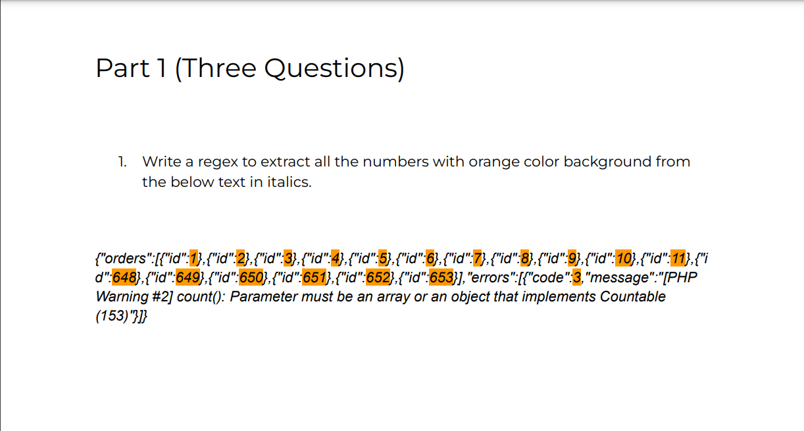
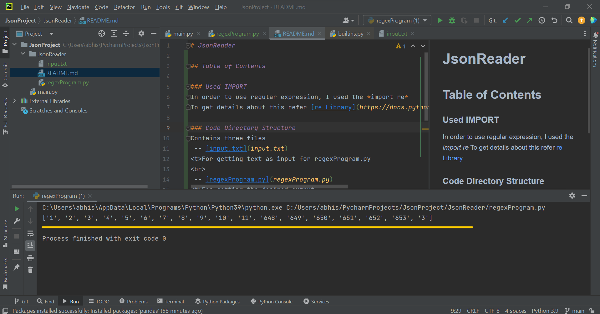

# JsonReader

## Table of Contents
- [Question](#question)
- [Used IMPORT](#used-import)
- [Code Directory Structure](#code-directory-structure)
- [Output Image](#output-image)

### Question

### Used IMPORT
In order to use regular expression, I used the *import re*
To get details about this refer [re Library](https://docs.python.org/3/library/re.html)

### Code Directory Structure
Contains three files
 
 
 -- [input.txt](input.txt)  
For getting text as input for regexProgram.py
 

 -- [regexProgram.py](regexProgram.py)
 For getting the desired output
 

 -- [README.md](README.MD)
 For getting the details of the project
 

-- [Images](Images)
 For getting the image of question and output
 

### Output Image

